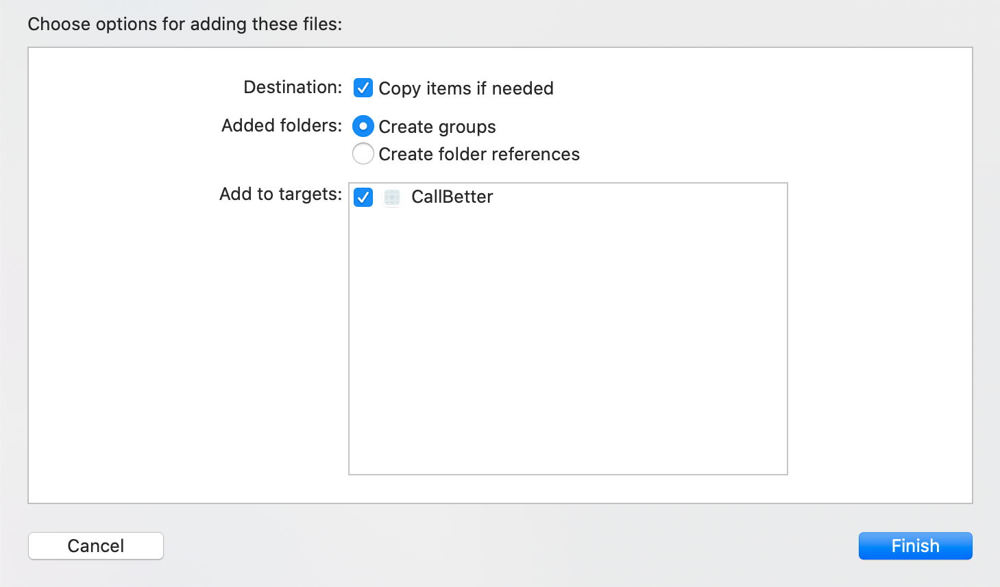

# PicUP

Want your app to enable the next generation of phone calls? Look no further! 

By utilizing PicUP patented technology, PicUP client SDK enables rich digital communication over phone calls. PicUP Client iOS SDK is a Swift library for iOS that is part of PicUP Optimization & Personalization Platform for Phone Calls ©. 

## Features
* Design beautiful visual calling screens.
* Let your customers know who's calling them and why, using your brands' images and logo.
* Give them a good reason to pick up. They definitely will.

<p align="center">

</p>


## Requirements

Your app needs to have Contacts permission from the user, as described [here](https://developer.apple.com/documentation/contacts/requesting_authorization_to_access_contacts):

1. Add the required `NSContactsUsageDescription` key to your app’s `Info.plist` file, with a string that describes what your app does with the user’s contacts.
2. _(Optional)_ Call `CNContactStore().requestAccess(for: CNEntityType.contacts) {...}` to request contacts access. (If you don't, the SDK will request access when you initialize it.)

## Installation

The recommended way to install Bugsee is using [CocoaPods](https://www.cocoapods.org/), but  you can also download and install manually.

### CocoaPods

Add the following line to your Podfile:

```ruby
pod 'PicUPSDKv3'
```

Then run:

```
pod install
```

### Manual

Download the latest version from [here](https://github.com/PicupMobile/IOS.PicupSDKv3/releases) and extract it. Copy **SDKFramework/PicUPSDKv3.framework** to your project by drag and dropping it into Xcode project navigator. When asked, choose to **Copy items if needed**:

<p align="center">

</p>

## Initialization

Initialize the SDK by calling `register()`:

```swift
import PicUPSDKv3

// ...

PicUpSDK.shared.register(
    userName,
    clientPhoneNumber: userPhoneNumber,
    organizationCode: organizationCode, // from management console
    securityCode: securityCode, // from management console
    uuid: persistentUniqueString, // e.g. push token
    completion: { result in
        // ...
    }
)
```

## Optional Usage

### Disable the SDK or enable it back:

```swift
PicUpSDK.shared.disableService()
PicUpSDK.shared.enableService()
```

### Clear all data and restore the user's contacts to what was before:

```swift
PicUpSDK.shared.clearData()
```
